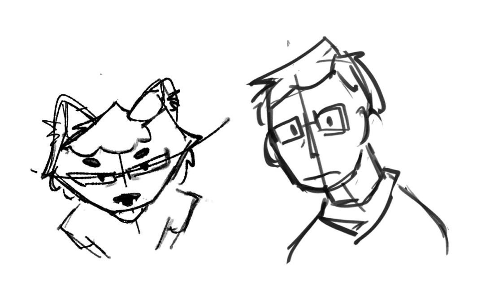

hi! i'm nedo, although due to the shortness of this nickname, i often appear as nedoxff.

## fun facts

- i'm eastern european (ru/en)
- i use he/him
- i'm a first-year cybersecurity student
- my fursona is a [pine marten](https://en.wikipedia.org/wiki/European_pine_marten)! :3

## code

i develop stuff when i feel like it, and it has been this way since i was ~8 y/o. my primary language is C#, but i've been experimenting with web development and web design for quite some time now. i've also done some professional work as a full-stack software engineer, and can do a bunch of stuff if i have the motivation to study it.

currently, i'm making [impoexpo](https://github.com/IT-FAMCS/impoexpo) *(and its derivatives, [impoexpo-docs](https://github.com/IT-FAMCS/impoexpo-docs) and [SimpleOfficePatchers](https://github.com/IT-FAMCS/SimpleOfficePatchers))* — a node-based editor for simpler data transfer between unrelated services:

## art

occasionally, i also draw animal people:

<table align="center">
 <tr>
  <td width="500" valign="top">
    
      
    
  </td>
  
  <td width="500" valign="top">
    
      
    

      
    

  </td>
 </tr>
</table>

the image gallery is subject to change.